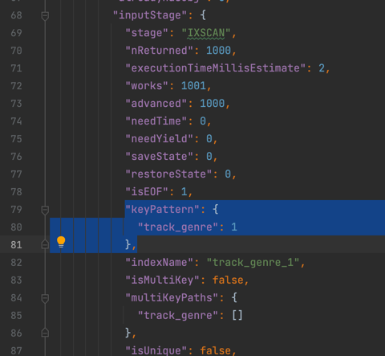
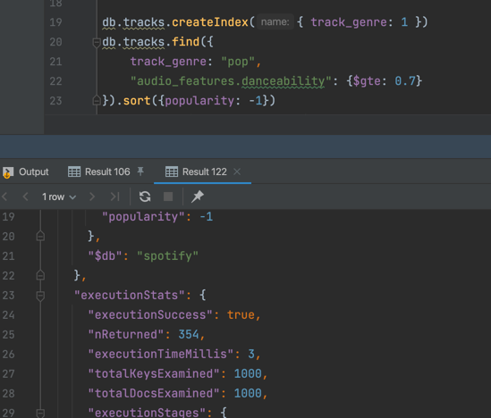

# Task 1.2

1. Чому аудіо-характеристики винесені в окремий об’єкт audio_features, а не зберігаються плоско? Коли таке вкладення вигідне, а коли створює проблеми?

#### Дані в audio_features логічно об'єднані та частіше будуть запитуватися разом. Зручніше оновлювати всі features, як окремий об'єкт. Але додається трохи складнощів, якщо потрібн буде робити якісь операції над цими полями або створювати індекси.

2. Чому виконавці зберігаються як масив, а не як рядок? Які запити стають простішими?

#### Пошук, входження чи пересічення масивів простіше реалізувати, ніж пошук по тексту.

4. Що таке $out і чим він відрізняється від $merge? Коли використовувати кожен?

#### $out записує докемунти в колекцію (перезатираючи існуючі дані), створює колекцію, якщо не існує. Варто використовувати при init наповненні колекції або коли потрібно завантажити дані з нюля.
#### $merge оновлює документи або додає нові до колекції. Застосовується коли потрібно доповнити колекцію і зберегти існуючі дані. 


# Task 2

1. Для чого використовується інструкція $unwind?

#### Для розпаковування масиву в набір документів, по якому можна далі ітеруватися, виконувати над ними різні перетворення і т.д.

2. Чим $stdDevPop відрізняється від $stdDevSamp?

#### $stdDevPop - для отримання стандартного відхилення по всьому набору даних,  $stdDevSamp - стандартне відхилення по певній вибірці з даних.


# Task 3

1. У запиті 1 ми фільтруємо виконавців, у яких менше 5 треків. Як зміниться результат, якщо знизити поріг до 1? А що станеться, якщо вибирати виконавців із більш ніж 50 треками? Поясніть результат.

#### Якщо к-сть треків знизити до 1, то в вибірку можуть потрапити виконавці з 1-2 треками, що мають високу популярність (що не дуже говорить про справжню популярність виконавця).
#### Якщо к-сть треків збільшити до 50, то в вибірку можуть потрапити виконавці з досить низькою популярністю, тільки за рахунок кількості треків.

2. У запиті 3 ми фільтруємо жанри з менше ніж 100 треками. Чи зміниться результат, якщо знизити поріг до 50? Поясніть результат.

#### Результат зміниться, отримані жанри можуть менш підходити під танцювальний стиль, але поплять до видірки через особливість треків, що ввійшли до вибірки. Треки можуть бути більш танцювальні, але жанр таким не є.


# Task 4

1. Що змінилося в плані виконання?

#### Час виконання змінився з 75 до 3 milliseconds (executionTimeMillis), кількість перебраних документів змінилась з 113999 до 1000.

2. Як зрозуміти, що індекс використовується? Наведіть скріншот або значення полів із explain(), які це підтверджують.

#### Це видно по часу виконання, кількості перевірених документів і переліку індексів з IXSCAN stage в inputStage.






Дано запит:
```
db.tracks.find({
  track_genre: "pop",
  popularity: { $gte: 70 }
});
```


3. Питання: Чи є цей запит покривним (covered query)? Надайте розгорнуту та обґрунтовану відповідь у файлі README.

#### Запит не є covered query. Для нього не виконуються основні вимоги.
#### У фільтрах мають бути тільки поля, які наявні в індексі.
#### В проєкцію мають сходити тільки поля з індексу, що не виконується для заданого прикладу. 
#### З проєкції повинно бути виключено _id, що теж не виконується для заданого прикладу.  